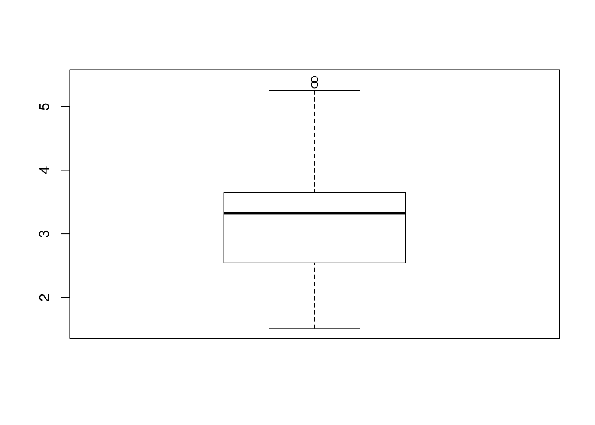

# - `mtcars`

## Cargando los datos

Para este ejercicio usaremos la librería `mtcars`.


```r
data(mtcars)
attach(mtcars)
head(mtcars)
```

```
##                    mpg cyl disp  hp drat    wt  qsec vs am gear carb
## Mazda RX4         21.0   6  160 110 3.90 2.620 16.46  0  1    4    4
## Mazda RX4 Wag     21.0   6  160 110 3.90 2.875 17.02  0  1    4    4
## Datsun 710        22.8   4  108  93 3.85 2.320 18.61  1  1    4    1
## Hornet 4 Drive    21.4   6  258 110 3.08 3.215 19.44  1  0    3    1
## Hornet Sportabout 18.7   8  360 175 3.15 3.440 17.02  0  0    3    2
## Valiant           18.1   6  225 105 2.76 3.460 20.22  1  0    3    1
```

Veamos un breve resumen de los datos.


```r
summary(mtcars)
```

```
##       mpg             cyl             disp             hp       
##  Min.   :10.40   Min.   :4.000   Min.   : 71.1   Min.   : 52.0  
##  1st Qu.:15.43   1st Qu.:4.000   1st Qu.:120.8   1st Qu.: 96.5  
##  Median :19.20   Median :6.000   Median :196.3   Median :123.0  
##  Mean   :20.09   Mean   :6.188   Mean   :230.7   Mean   :146.7  
##  3rd Qu.:22.80   3rd Qu.:8.000   3rd Qu.:326.0   3rd Qu.:180.0  
##  Max.   :33.90   Max.   :8.000   Max.   :472.0   Max.   :335.0  
##       drat             wt             qsec             vs        
##  Min.   :2.760   Min.   :1.513   Min.   :14.50   Min.   :0.0000  
##  1st Qu.:3.080   1st Qu.:2.581   1st Qu.:16.89   1st Qu.:0.0000  
##  Median :3.695   Median :3.325   Median :17.71   Median :0.0000  
##  Mean   :3.597   Mean   :3.217   Mean   :17.85   Mean   :0.4375  
##  3rd Qu.:3.920   3rd Qu.:3.610   3rd Qu.:18.90   3rd Qu.:1.0000  
##  Max.   :4.930   Max.   :5.424   Max.   :22.90   Max.   :1.0000  
##        am              gear            carb      
##  Min.   :0.0000   Min.   :3.000   Min.   :1.000  
##  1st Qu.:0.0000   1st Qu.:3.000   1st Qu.:2.000  
##  Median :0.0000   Median :4.000   Median :2.000  
##  Mean   :0.4062   Mean   :3.688   Mean   :2.812  
##  3rd Qu.:1.0000   3rd Qu.:4.000   3rd Qu.:4.000  
##  Max.   :1.0000   Max.   :5.000   Max.   :8.000
```

## Tablas de frecuencias

Calculamos las tablas de frecuencias de las variables `cyl` y `gear`


```r
table(cyl)
```

```
## cyl
##  4  6  8 
## 11  7 14
```


```r
table(gear)
```

```
## gear
##  3  4  5 
## 15 12  5
```


Para obtener la tabla con formato latex, usamos el paquete `Knitr`


```r
library(knitr)
print(knitr::kable(as.data.frame(table(gear)), format = "latex",
       col.names = c("Cilindradas","Num. Cilindradas"),align='c',
       caption="Cilindradas por coches"))
```

```
## \begin{table}
## 
## \caption{(\#tab:unnamed-chunk-5)Cilindradas por coches}
## \centering
## \begin{tabular}[t]{c|c}
## \hline
## Cilindradas & Num. Cilindradas\\
## \hline
## 3 & 15\\
## \hline
## 4 & 12\\
## \hline
## 5 & 5\\
## \hline
## \end{tabular}
## \end{table}
```

Como este documento esta hecho en `markdown`, exportamos la tabla como `markdown`,


```r
library(knitr)
print(knitr::kable(as.data.frame(table(gear)), format = "markdown",
       col.names = c("Cilindradas","Num. Cilindradas"),align='c',
       caption="Cilindradas por coches"))
```

| Cilindradas | Num. Cilindradas |
|:-----------:|:----------------:|
|      3      |        15        |
|      4      |        12        |
|      5      |        5         |

## Tablas de frecuencia absolutas, relativas y acumuladas

Realizaremos este apartado para las variables `am` y `carb`. La tabla de frecuencia absoluta es,


```r
print(knitr::kable( table(am,carb), format = "markdown",
align='c',caption="Tabla Transmisión-Nº de carburadores"))
```

|   | 1 | 2 | 3 | 4 | 6 | 8 |
|:--|:-:|:-:|:-:|:-:|:-:|:-:|
|0  | 3 | 6 | 3 | 7 | 0 | 0 |
|1  | 4 | 4 | 0 | 3 | 1 | 1 |


```r
print(knitr::kable(table(am,carb), format = "markdown",
align='c',caption="Tabla Transmisión-Nº de carburadores"))
```

La tabla de frecuencia relativa es,


```r
print(knitr::kable(prop.table(table(am,carb)), format = "markdown",
align='c',caption="Tabla Transmisión-Nº de carburadores"))
```
|   |    1    |   2    |    3    |    4    |    6    |    8    |
|:--|:-------:|:------:|:-------:|:-------:|:-------:|:-------:|
|0  | 0.09375 | 0.1875 | 0.09375 | 0.21875 | 0.00000 | 0.00000 |
|1  | 0.12500 | 0.1250 | 0.00000 | 0.09375 | 0.03125 | 0.03125 |

La tabla de frecuencia acumulada para `carb` es,


```r
print(knitr::kable(cumsum(table(carb))), format = "markdown")
```

|  | 1 | 2 | 3 | 4 | 6 | 8 |
|:-|:-:|:-:|:-:|:-:|:-:|:-:|
|  | 7 |17 |20 |30 |31 |32 |

La tabla de frecuencia acumulada para `am` es,


```r
print(knitr::kable(cumsum(table(am))), format = "markdown")
```

|  | 0 | 1 |
|:-|:-:|:-:|
|  |19 |32 |

## Resumen descriptivo

Con la función `summary()`, realiazamos un estudio sobre nuestros datos,


```r
summary(mtcars)
```

```
##       mpg             cyl             disp             hp       
##  Min.   :10.40   Min.   :4.000   Min.   : 71.1   Min.   : 52.0  
##  1st Qu.:15.43   1st Qu.:4.000   1st Qu.:120.8   1st Qu.: 96.5  
##  Median :19.20   Median :6.000   Median :196.3   Median :123.0  
##  Mean   :20.09   Mean   :6.188   Mean   :230.7   Mean   :146.7  
##  3rd Qu.:22.80   3rd Qu.:8.000   3rd Qu.:326.0   3rd Qu.:180.0  
##  Max.   :33.90   Max.   :8.000   Max.   :472.0   Max.   :335.0  
##       drat             wt             qsec             vs        
##  Min.   :2.760   Min.   :1.513   Min.   :14.50   Min.   :0.0000  
##  1st Qu.:3.080   1st Qu.:2.581   1st Qu.:16.89   1st Qu.:0.0000  
##  Median :3.695   Median :3.325   Median :17.71   Median :0.0000  
##  Mean   :3.597   Mean   :3.217   Mean   :17.85   Mean   :0.4375  
##  3rd Qu.:3.920   3rd Qu.:3.610   3rd Qu.:18.90   3rd Qu.:1.0000  
##  Max.   :4.930   Max.   :5.424   Max.   :22.90   Max.   :1.0000  
##        am              gear            carb      
##  Min.   :0.0000   Min.   :3.000   Min.   :1.000  
##  1st Qu.:0.0000   1st Qu.:3.000   1st Qu.:2.000  
##  Median :0.0000   Median :4.000   Median :2.000  
##  Mean   :0.4062   Mean   :3.688   Mean   :2.812  
##  3rd Qu.:1.0000   3rd Qu.:4.000   3rd Qu.:4.000  
##  Max.   :1.0000   Max.   :5.000   Max.   :8.000
```

## Outliers

Vamos a estudiar los posibles `outliers` de la variable `wt`. Primero la representamos por un diagrama de caja y bigote


```r
gr <- boxplot(wt)
```



Observamos que hay dos datos atípicos. Veamos cuales son.


```r
gr$out
```

```
## [1] 5.424 5.345
```

A continuación, lo veremos con la variable `hp`


```r
gr <- boxplot(hp)
```


Observamos que hay un valor atípico.


```r
gr$out
```

```
## [1] 335
```

## Histograma

Vamos a calcular el histograma para `drat` y `carb`


```r
hist(drat)
```


```r
hist(carb)
```


## Regresión

Estudiamos que variables son mas adecuadas para hacer una regresión.


```r
pairs(mtcars)
```


Interactuaremos con la siguiente aplicación `shiny` para todas las variables de los datos.


```r
# require(shiny)
# shinyApp(
#   
#   ui = fluidPage(    
#   
#   titlePanel("Regresión de Y~X"),
#   
#   sidebarLayout(      
#     
#     sidebarPanel(
#       selectInput("variable1", "Variable Y:", 
#                   choices=c("mpg", "cyl",   
#                  "disp","hp","drat","wt","qsec","vs","am","gear","carb")),
#       hr(),
#       selectInput("variable2", "Variable X:", 
#                   choices=c("mpg", "cyl", 
#                  "disp","hp","drat","wt","qsec","vs","am","gear","carb"))
#     ),
#     
#     mainPanel(
#       fluidRow(column(12, verbatimTextOutput("correlacion")))
#     )
#     
#   )
# ),
# 
#   server = function(input, output) {
# 
#   output$correlacion <- renderPrint({
#     summary(lm(mtcars[input$variable1][,1] ~ mtcars[input$variable2][,1]))
#     #trees[input$variable1][,1], 
#   })
# },
# 
#   options = list(height = 750)
# )
```

De la misma manera, lo haremos para el coeficiente de correlación lineal.


```r
# require(shiny)
# shinyApp(
#   
#   ui = fluidPage(    
#   
#   titlePanel("Coeficiente de regresión de Y~X"),
#   
#   sidebarLayout(      
#     
#     sidebarPanel(
#       selectInput("variable1", "Variable Y:", 
#                   choices=c("mpg", "cyl",   
#                  "disp","hp","drat","wt","qsec","vs","am","gear","carb")),
#       hr(),
#       selectInput("variable2", "Variable X:", 
#                   choices=c("mpg", "cyl",   
#                  "disp","hp","drat","wt","qsec","vs","am","gear","carb"))
#     ),
#     
#     mainPanel(
#       fluidRow(column(12, verbatimTextOutput("correlacion")))
#     )
#     
#   )
# ),
# 
#   server = function(input, output) {
# 
#   output$correlacion <- renderPrint({
#     cor(mtcars[input$variable1][,1],mtcars[input$variable2][,1])
#   })
# },
# 
#   options = list(height = 450)
# )
```

